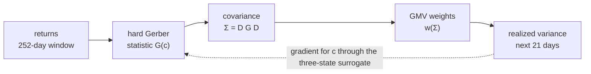
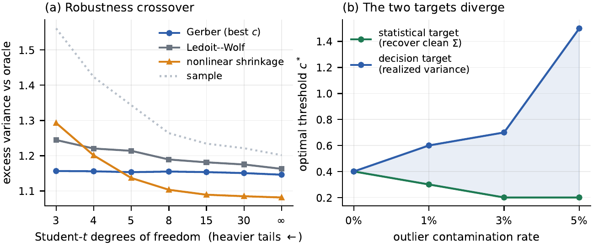

# DiffGerber: Decision-Focused Learning of the Gerber Threshold

Official code and result files for the paper:

> **Decision-Focused Learning of the Gerber Threshold**<br>
> Juyeong Lee, Donghwa Seo, Minjae Lee, Seunghan Son, Minsuk Sung, Doohwi Cha, Yoontae Hwang<br>
> *7th ACM International Conference on AI in Finance (ICAIF '26)*, November 14–17, 2026, Milan, Italy

| Author | Affiliation |
|--------|-------------|
| Juyeong Lee (first author) | EY Consulting |
| Donghwa Seo | DS Investment & Securities |
| Minjae Lee | Independent Researcher |
| Seunghan Son | Independent Researcher |
| Minsuk Sung | Korea University |
| Doohwi Cha | Mirae Asset Securities |
| Yoontae Hwang (corresponding author) | Pusan National University |

## In short

- The **Gerber statistic** is a robust co-movement measure that counts only the
  days on which two assets both move by more than a threshold `c·σ`. The
  threshold is fixed by convention at `c = 0.5`, independently of what the
  covariance matrix is later used for.
- **DiffGerber learns that threshold from realized portfolio risk.** The
  difficulty is that the statistic is built from indicators, so the portfolio
  objective is piecewise constant in `c` and its exact gradient is zero almost
  everywhere.
- Our answer is **exact deployment**: every forward pass evaluates the
  published hard statistic, and a tempered three-state surrogate is used *only*
  to define the backward pass. The matrix that is trained is, bit for bit, the
  matrix that is deployed.

## The problem

Decision-focused learning trains a statistical component against the loss of
the decision it feeds rather than against a prediction error. That is a natural
fit for portfolio construction, where the global minimum-variance (GMV)
portfolio inverts the covariance matrix and amplifies whatever error it
contains.

For asset $`i`$ with standardized return $`z_{ti} = r_{ti} / \hat\sigma_i`$, the
Gerber statistic assigns each day to one of three states — up, down or
neutral — and normalizes signed co-movement by pairwise activity:

```math
m_{ti}(c) = \mathbf{1}\{z_{ti} > c\} - \mathbf{1}\{z_{ti} < -c\},
\qquad
\nu_{ti}(c) = \mathbf{1}\{|z_{ti}| \le c\}
```

```math
G^{\mathrm{h}}_{ij}(c) =
\frac{\sum_{t=1}^{T} m_{ti}(c)\, m_{tj}(c)}
     {T - \sum_{t=1}^{T} \nu_{ti}(c)\, \nu_{tj}(c)}
```

The Gerber covariance is $`D\, G^{\mathrm{h}} D`$, with $`D`$ the diagonal matrix
of volatilities. A pair that is jointly neutral on every day of the window has
an undefined ratio; the code treats such a pair as uncorrelated and applies the
same convention in training and in deployment.

Two obstacles stand between this estimator and gradient-based learning:

1. **No gradient.** The indicators make the objective a step function of `c`.
   Finite differences work for a single scalar but scale linearly with the
   number of parameters.
2. **Train/deploy mismatch.** Replacing the indicators with a smooth relaxation
   gives gradients, but it optimizes a matrix that is not the one used after
   training. Because GMV inverts the matrix, a small difference in the
   covariance can become a large difference in the weights.

## The method



**1. Hard forward pass.** The Gerber matrix that reaches the portfolio layer is
always the hard statistic, scaled by fixed volatilities. In the base model
(DG-GMV) the threshold is the only learned parameter. DG-Shrink and DG-Group
also learn a blend intensity $`\delta`$ and pass
$`\delta\, D G D + (1-\delta)\, S`$ to the portfolio layer, where $`S`$ is the
sample covariance.

**2. Surrogate backward pass.** A tempered softmax over the three states, with
logits $`\big((z-c)/\tau,\ (-z-c)/\tau,\ 0\big)`$, gives soft versions
$`m^{\mathrm{s}}`$ and $`\nu^{\mathrm{s}}`$ of the signed and neutral states. A
straight-through construction keeps the hard value and borrows the soft
derivative (sg is stop-gradient):

```math
\tilde m = m^{\mathrm{s}} + \mathrm{sg}\big(m^{\mathrm{h}} - m^{\mathrm{s}}\big),
\qquad
\tilde \nu = \nu^{\mathrm{s}} + \mathrm{sg}\big(\nu^{\mathrm{h}} - \nu^{\mathrm{s}}\big)
```

**3. Quotient-complete gradient.** Raising the threshold changes both the
signed co-movement numerator *and* the pairwise-activity denominator, and the
two effects can oppose each other. DiffGerber differentiates both. Dropping
the denominator path — the "numerator-only" ablation below — sends the
optimizer to a different, worse threshold.

**4. Decision sensitivity.** The gradient continues through the closed-form GMV
solution

```math
w(\Sigma) =
\frac{(\Sigma + \rho \bar{s} I)^{-1} \mathbf{1}}
     {\mathbf{1}^{\top} (\Sigma + \rho \bar{s} I)^{-1} \mathbf{1}},
\qquad \bar{s} = \tfrac{1}{N} \mathrm{tr}\, \Sigma
```

to the realized variance of the portfolio over the following 21 trading days,
measured as the mean squared daily portfolio return. The same scale-relative
ridge $`\rho = 10^{-3}`$ is used in training and in evaluation.

**5. Annual expanding refits.** For each deployment year, parameters are refit
only on episodes whose full outcome window ends before that year begins.

The model family, in the paper's names:

| Arm | What is learned | Decision rule |
|-----|-----------------|---------------|
| **DG-GMV** | one scalar threshold | global minimum variance |
| **DG-Asym** | separate up / down thresholds | global minimum variance |
| **DG-Shrink** | threshold and the blend intensity δ between the Gerber and sample covariances | global minimum variance |
| **DG-Group** | asset-class thresholds, jointly with the blend (mixed universes) | global minimum variance |
| **DG-HRP** | threshold; the learned hard correlation is passed to HRP | hierarchical risk parity |

Comparators are the published fixed-threshold Gerber rule (`c = 0.5`),
Ledoit–Wolf linear shrinkage, analytical nonlinear shrinkage, HRP and equal
weighting.

### Minimal example

```python
import torch
from diffgerber import (SoftGerber, GlobalThreshold, hard_gerber,
                        gmv_closed_form, decision_loss)

torch.manual_seed(0)
T, H, N = 252, 21, 25
R = 0.01 * torch.randn(T + H, N, dtype=torch.float64)
window, future = R[:T], R[T:]             # estimation window, outcome window

sigma = window.std(0)                     # volatility scale, held fixed
z = window / sigma

threshold = GlobalThreshold(init=0.5)     # c = softplus(theta)
gerber = SoftGerber(normalization="gs2022", straight_through=True)

c = threshold()
G = gerber(z, c, tau=0.1)
assert torch.equal(G, hard_gerber(z, c, normalization="gs2022"))  # exact forward

Sigma = sigma[:, None] * G * sigma[None, :]
w = gmv_closed_form(Sigma, ridge=1e-3)    # differentiable GMV weights
loss = decision_loss(w, future)           # mean squared portfolio return
loss.backward()                           # threshold.raw.grad is non-zero
```

Run it from the repository root with `PYTHONPATH=src`.

## Main results

Annualized realized volatility in percent, net of 10 bp one-way turnover
costs, 2017–2026, 114 non-overlapping monthly episodes. Lower is better. The
p-values are Diebold–Mariano tests on per-episode realized variances against
the fixed-threshold Gerber rule.

| Universe | Fixed Gerber `c = 0.5` | DiffGerber | p | Result file |
|----------|-----------------------:|-----------:|--:|-------------|
| Market-cap top-100 equities | 14.04 | **13.76** (DG-GMV) | 0.25 | `main_metrics_gs2022.csv` |
| Sector-balanced equities, n = 30 | 14.43 | **14.26** (DG-Shrink) | 0.53 | `headline_metrics.csv` |
| Sector-balanced equities, n = 70 | 13.86 | **13.64** (DG-Shrink) | 0.37 | `headline_metrics.csv` |
| Equities + nine-ETF sleeve, n = 30 | 4.31 | **3.92** (DG-Group) | 0.0002 | `mixed_group_metrics.csv` |
| Equities + nine-ETF sleeve, n = 70 | 4.46 | **4.00** (DG-Group) | 0.0002 | `mixed_group_metrics.csv` |

The DiffGerber column shows the arm the paper leads with in each universe, and
the p-values come from the matching `*_dm.csv` files. Two things are worth
reading alongside the table:

- DG-Shrink and DG-Group learn the blend intensity as well as the threshold.
  With the scalar threshold alone (DG-GMV), the sector-balanced rows are 14.33
  and 13.76 (p = 0.64 and 0.45) and the mixed rows 4.13 and 4.25 (p = 0.08 and
  0.22).
- The p-values compare against the fixed-threshold Gerber rule only. Analytical
  nonlinear shrinkage reaches 4.02 and 4.42 in the mixed universes, and
  DG-Group's margin over it is not significant at the 5 percent level
  (p = 0.33 and 0.08).

**Does the surrogate find the right answer?** On the top-100 universe the
threshold is a single scalar, so the exact hard objective can also be
optimized directly by central finite differences. The complete surrogate and
the exact route arrive at the same low-risk threshold region; the incomplete
routes do not (`ablation_forward_backward.csv`):

| Route | Forward | Backward | Deployed | Volatility |
|-------|---------|----------|----------|-----------:|
| **DiffGerber** | hard | surrogate, numerator and denominator | hard | **13.76** |
| Exact finite differences | hard | central difference on the hard objective | hard | 13.72 |
| Numerator-only | hard | surrogate, numerator only | hard | 14.01 |
| Soft-to-hard transfer | soft | surrogate | hard | 14.01 |
| Soft throughout | soft | surrogate | soft | 13.95 |

**Reconstruction and decision risk prefer different thresholds.** In a
controlled simulation with the estimator family held fixed, increasing outlier
contamination pushes the threshold that best recovers the clean covariance
*down* and the threshold that minimizes realized portfolio variance *up* —
which is the case for learning from the decision loss rather than from matrix
reconstruction.

<p align="center">
  
</p>

**Where learning does not help.** The paper reports its negative controls and
so does this repository. In equity-only universes the gain over the fixed rule
is small and not individually significant (p-values above). On the top-100
universe, three further conditions turn out to be necessary:

| Condition | What happens when it fails | Result file |
|-----------|----------------------------|-------------|
| The loss must be informative | Training on realized Sharpe instead of realized variance collapses the threshold towards zero and gives an out-of-sample Sharpe of 0.30, against 0.54 under variance training | `sharpe_objective_top100.csv` |
| The decision must stay covariance-sensitive | Under a long-only minimum-variance layer, learning raises volatility from 14.84 to 15.00 (p = 0.02) | `decision_dependence.csv`, `decision_dependence_dm.csv` |
| Capacity must match the sample | Per-asset thresholds (14.15) and a market-state network (14.44) do worse than the single scalar (13.76) | `main_metrics_gs2022.csv` |

Fitting the threshold to reconstruct the realized covariance instead keeps it
between 0.46 and 0.51 — the published region — at 14.08 volatility, while
training through the portfolio decision moves it to between 0.89 and 1.23 and
reaches 13.76 (`reinforcement_frobenius.csv`, `main_metrics_gs2022.csv`).

## Reproducing the paper

Daily prices and point-in-time index membership come from a licensed vendor
warehouse and **cannot be redistributed**, so reproduction is layered:

| Tier | Needs | What it reproduces |
|------|-------|--------------------|
| **A** | nothing beyond Python | Every reported number, table and figure, from the shipped result files |
| **B** | nothing beyond Python | The ground-truth simulation study end to end |
| **C** | a price/membership source | The full walk-forward experiments |

### Setup

```bash
git clone https://github.com/jubro839/DiffGerber.git && cd DiffGerber
conda env create -f environment.yml && conda activate diffgerber
# or: pip install -r requirements.txt
```

Tiers A and B need only `torch`, `pandas`, `numpy`, `scipy`, `scikit-learn`
and `matplotlib`. `cvxpylayers` is used by the long-only decision layer, and
`psycopg`, `python-dotenv` and `pyarrow` only by the warehouse loader.
`environment.yml` pins the versions behind the shipped results.

### Tier A — verify the numbers without any data

```bash
python paper/make_tables.py        # regenerates paper/tables/T1..T7 (LaTeX)
python paper/verify_numbers.py     # assertions against experiments/results/
python paper/make_figures.py       # regenerates paper/figures/ (PDF and PNG)
python tools/check_provenance.py   # every input traces to a producing script
```

`paper/verify_numbers.py` re-checks 191 numerical and ordinal claims against
`experiments/results/` and exits non-zero on any mismatch. It checks orderings
as well as numbers, so a rerun that reshuffles a panel fails rather than
passing quietly. The claimed values are recorded in the script, so it runs
without the manuscript; a further block that parses the LaTeX source runs only
when `paper/main.tex` is present, and that file is not part of this release.

The LaTeX tables are generated from the CSV files in `experiments/results/`,
and `verify_numbers.py` is the gate that keeps reported numbers and data in
agreement. `check_provenance.py` closes the other
direction — it walks from the paper's inputs back to the experiment script
that writes each one, so a result file that nothing in the release can
regenerate is reported as an orphan rather than passing unnoticed.

### Tier B — runs with no external data

```bash
python experiments/smoke_test.py       # ~10 s. Soft→hard consistency, PSD,
                                       # gradient flow, toy end-to-end training
python experiments/demo_synthetic.py   # ~30 s. Full pipeline (learning,
                                       # annual refits, walk-forward, metrics)
                                       # on synthetic heavy-tailed returns
python experiments/simulation_study.py # ~10 min. The controlled simulation:
                                       # the robustness crossover and the
                                       # two-target result (Figure 2)
```

`demo_synthetic.py` is the quickest way to see the whole pipeline work. Its
performance table is a pipeline check rather than evidence — 25 assets and one
generator draw cannot separate estimators — but after the first two refits the
learned threshold settles below 0.5, which is the tail mechanism the paper
describes.

### Tier C — full experiments (requires a data source)

`src/diffgerber/data.py` is the only module that touches the warehouse. It
reads four things from a PostgreSQL `marts` schema:

| Table | Columns used |
|-------|--------------|
| `mv_prices_adjusted` (+ `mst_security`) | `market_date`, `fmp_symbol`, `close_total_return` |
| `mst_universe_history` | `fmp_symbol`, `effective_from`, `effective_to` |
| `security_market_cap` | `security_id`, `market_date`, `market_cap_fmp` |
| `mst_universe` | `fmp_symbol`, `sector`, `cik` |

Crypto experiments additionally read `crypto_prices`, and the state-conditioned
experiments read index closes (VIX, Treasury yields, S&P 500) from
`index_prices`. Any source that supplies daily
total-return prices, membership intervals with effective dates, daily market
capitalizations and sector labels can be substituted by reimplementing that
one module; nothing downstream is source-specific.

Credentials are read from a dotenv file pointed at by `DIFFGERBER_FMP_ENV` (or
from `.env` at the repository root), containing `FMP_DB_HOST`, `FMP_DB_PORT`, `FMP_DB_NAME`, `FMP_DB_USER`,
`FMP_DB_PASSWORD`. Query results are cached as parquet under `data/cache/`.

With a data source in place, the experiments in this release are:

| Script | Produces | Approx. runtime |
|--------|----------|-----------------|
| `headline_pack.py` | the headline panel: sector-balanced universes (the paper reports n = 30 and 70; the sweep also writes n = 20, 40, 50, 100), every arm and baseline, tests, sub-periods, certainty equivalents | 90 min |
| `main_experiments.py gs2022` | market-cap top-100 panel, the second design | 25 min |
| `threshold_grid.py` | constant-threshold grid and oracle recovery | 40 min |
| `e1_ans.py` | analytical nonlinear shrinkage baseline | 20 min |
| `top_universe_5metrics.py` | five-metric panels, DG-HRP / DG-Shrink | 45 min |
| `sector_universe.py` | sector-balanced universes | 40 min |
| `architecture_v2b.py` | rolling selection rules | 45 min |
| `arch_v3_dev.py` → `arch_v3_holdout.py` | development sweep, then the single held-out confirmation | 60 + 60 min |
| `economic_value.py` | cost curves, certainty equivalents, sub-periods | 25 min |
| `prereg_extensions.py` | turnover penalty, learned shrinkage intensity | 40 min |
| `reinforcement.py` | paired bootstrap, 2-D grid control, 3-parameter joint learning, estimation-objective contrast, analytic-δ baseline, mechanism table | 50 min |
| `forward_backward_ablation.py` | hard/soft forward x surrogate/finite-difference backward, with learned threshold paths and per-refit timings | 15 min |
| `relaxation_gap.py` | how far the soft matrix sits from the hard one, in matrix norm and in the decision, along the annealing path | 5 min |
| `gradient_decomposition.py` | how much of dL/dc flows through the Gerber denominator vs the numerator, per fold and temperature | 5 min |
| `ablation_c_delta.py` | factorial over learning the threshold c and the shrinkage intensity delta: each alone, fixed grids, both, neither | 60 min |
| `mixed_universe_experiment.py` | mixed universes: the sector-balanced equity selection plus a fixed nine-ETF sleeve (IWM EFA EEM AGG HYG TIP GLD VNQ TLT), single learned threshold against the constant-threshold ceiling | 15 min |
| `mixed_group_experiment.py` | the mixed block of Table 1: asset-class group thresholds (c_eq, c_slv) alone and jointly with the shrinkage blend, plus the 4x4 constant (c_eq, c_slv) ceiling grid | 25 min |
| `sector_ceiling_experiment.py` | the constant-threshold ceiling for the sector-balanced universes: a ten-point grid through the same protocol, so the learned coefficient can be read against the best a fixed choice could have made with hindsight | 20 min |
| `mixed_arms_experiment.py` | the remaining mixed-universe arms: DG-Asym (learned up/down thresholds) and DG-HRP (learned correlation into the same hierarchical rule as the HRP comparator) | 10 min |
| `multiasset_experiment.py` | nine- and twelve-asset ETF universes (equities, bonds, credit, TIPS, gold, REITs, commodities): learned threshold, constant-threshold ceiling, baselines | 10 min |
| `ew_and_wealth.py` | equal-weight baseline and cumulative wealth paths | 30 min |
| `decision_dependence.py`, `sharpe_objective.py`, `crypto_experiment.py`, `ablation_stability.py`, `conditioning_control.py`, `reviewer_gaps.py` | boundary conditions and robustness | 20–40 min each |

Runtimes are for a laptop CPU; the learned components have at most a few
hundred parameters, so training is not the bottleneck.

Training is seeded (`torch.manual_seed(0)`) and runs in float64, so repeated
runs of the same script reproduce their threshold paths. The one caveat is
that multi-threaded floating-point reductions are not bit-reproducible: an
independent retrain of the top-100 DG-GMV configuration reproduces eight of its ten
annual thresholds exactly and differs by at most 0.007 in the other two, which
moves annualized volatility by half a basis point. `verify_numbers.py` checks
that comparison against `experiments/results/ablation_fb_thresholds.csv`.

### A note on numbering

The code and result files date from the review version of the paper, and the
camera-ready presents a condensed layout (Tables 1–5, Figures 1–2). File names
under `paper/`, the section headers printed by `verify_numbers.py` and some
comments in the scripts keep the numbering of the review version. The result
files are the same; experiments that the camera-ready does not report (the
crypto panel, for example) are kept as supplementary robustness checks.

## Layout

```
src/diffgerber/
  soft_gerber.py      tempered three-state gates, straight-through estimator,
                      hard/soft Gerber matrices, degeneracy handling
  threshold_net.py    global / asymmetric / per-asset / state-conditioned modules
  portfolio_layer.py  differentiable GMV (closed form), long-only QP layer,
                      variance and downside decision losses
  backtest.py         walk-forward engine, five-metric reporting, cost model
  baselines.py        sample, EWMA, Ledoit-Wolf, analytical nonlinear shrinkage,
                      HRP (single/average/ward linkage), fixed-threshold Gerber
  stats.py            Diebold-Mariano with Newey-West, stationary bootstrap
  data.py             point-in-time universe construction and loaders
  model.py            convenience wrapper (thresholds, Gerber, GMV) used by the
                      smoke test; the experiments compose the layers directly
  gnn.py              experimental Gerber-graph forecaster, not used by any
                      experiment
experiments/          one script per result; results/ holds every number used
paper/                table, figure and verification pipeline
tools/                provenance check for the shipped result files
```

## Protocol

All experiments share a protocol fixed in advance: 252-day estimation window,
21-day rebalancing, evaluation from 2017, 10 bp costs (with 0/25/50 bp
sensitivity), scale-relative ridge `1e-3` applied identically in training and
evaluation, annual expanding refits that exclude folds whose realization
horizon crosses into the evaluation year, a fresh optimizer at each refit,
Adam at learning rate 0.02 for 40 epochs, and simple-return metrics. The
decision loss and the test losses are mean squared daily portfolio log
returns.
Significance uses Diebold-Mariano on per-fold realized variances with an
automatic Newey-West bandwidth and the Harvey-Leybourne-Newbold correction.

Two documents in `experiments/results/` record how the numbers came to be:
`audit_impact.md` (final results, and a side-by-side comparison against the
pre-audit versions that a corrective code audit invalidated) and
`phase4_interim.md` (the working record, including claims that were later
retracted). The `prereg_*` scripts and `arch_v3_holdout.py` were committed
before they were executed.

## Citation

```bibtex
@inproceedings{lee2026diffgerber,
  title     = {Decision-Focused Learning of the Gerber Threshold},
  author    = {Lee, Juyeong and Seo, Donghwa and Lee, Minjae and Son, Seunghan
               and Sung, Minsuk and Cha, Doohwi and Hwang, Yoontae},
  booktitle = {Proceedings of the 7th ACM International Conference on AI in
               Finance (ICAIF '26)},
  year      = {2026},
  address   = {Milan, Italy},
  publisher = {ACM}
}
```

The DOI will be added once the proceedings are published.

## Contact

Questions and bug reports are welcome as GitHub issues. You can also reach the
first author at juyeong.lee0839@gmail.com; the corresponding author's address
is listed in the paper.

## Acknowledgements and disclaimer

This research was supported by the Basic Science Research Program through the
National Research Foundation of Korea (NRF), funded by the Ministry of
Education (RS-2026-25576625), and by an NRF grant funded by the Korean
government (MSIT) (RS-2023-00242528).

The views and opinions expressed in the paper and in this repository are
solely those of the authors and do not represent the official position,
policies, or views of EY Consulting, Mirae Asset Securities, or DS Investment
& Securities.

## License

Code: MIT (see LICENSE). No market data is included in this repository.
